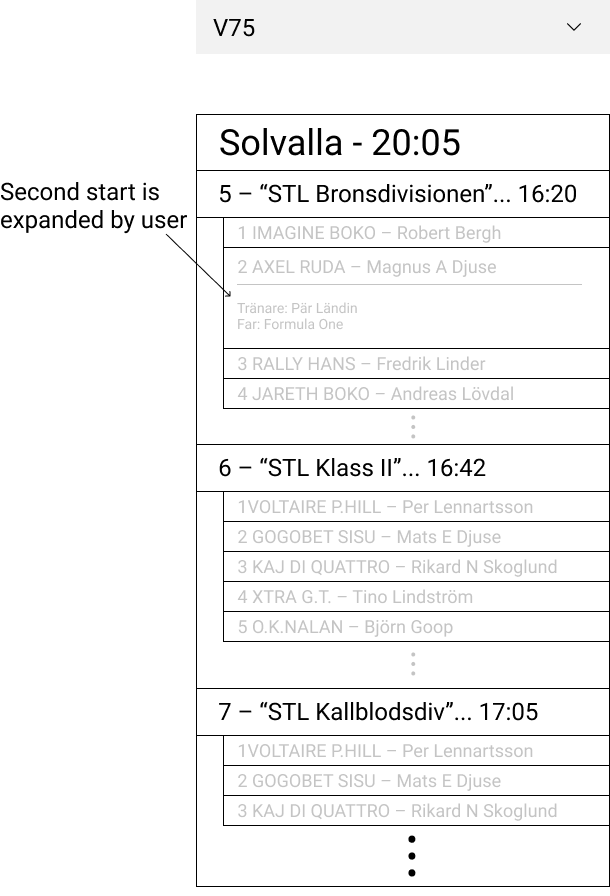

# ATG frontend case

## Introduction
Welcome to the team! We have just received a request from our shops to visualize the horse betting results in form of a single-page web application. The frontend application has already been built using as a **React** application (inside [/app](/app) directory), but it is missing tests. We need your help to implement end-to-end tests for this application. The end-to-end tests should make sure that the application fulfills the requirements listed below. We expect you to send us your solution as a zipped git archive.

In short, the user should be able to **select a horse betting type** of interest and the app should show the **most recent results for that bet type**. Information about the bet type’s races and starts should also be shown. More details regarding required features are available in the [Features](#Features) section below. The plan is to put an MVP (minimum viable product) into production as soon as possible and you will make it happen! Since we are putting this application into production, make sure you leave the project in a state that you or a team member would like to find it in six months when we need to update it or add new tests to it. A `README.md` in the root of your project with at least instructions regarding how to run the tests locally.

Happy coding and good luck!


## Requirements
*  Language: TypeScript (preferred) or JavaScript
*  Libraries: Feel free to use commonly used JavaScript libraries if it makes sense to you

## Wireframe



## Features
User should be able to:
*  Select a bet type (`V75`, `V86`, `GS75`) and the most recent result for that bet type should be displayed
    *  Following should be displayed: bet type, track name(s), start time
*  It should be possible to change sort order between most recent or oldest results first
*  See information about the selected bet type’s races
    *  Following should be displayed: race number, race name, race start time
*  See information about the starting horses in the race
    *  Following should be displayed: start number, horse name, driver first and last name
*  See detailed information about each horse by clicking a horse’s row
    *  Following should be presented: trainer first and last name, name of the horse father


## Racing info API
### Products
**GET** https://www.atg.se/services/racinginfo/v1/api/products/{betType}

**Parameters:**
| Name          | Examples             |
| ------------- | -------------------- |
| betType       | `V75`, `V86`, `GS75` |

### Games
**GET** https://www.atg.se/services/racinginfo/v1/api/games/{id}

**Parameters:**
| Name          | Examples            |
| ------------- | ------------------- |
| id            | `V75_2021-02-13_6_5`|


## How to submit the solution
The solution should be submitted as a git zip archive. You create an archive by running this command:

```git archive -o ./atg-case.zip HEAD```

Then send an email to your contact at ATG with the git archive zip attached.


## How to Run the Project Locally

### Steps : unzip the archive


cd app
npm install
npm run dev

cd ..

cd tests
npm install playwright
npx playwright install

npx playwright test

view test report:npx playwright show-report reports


issue identified:

Identified Issue: 